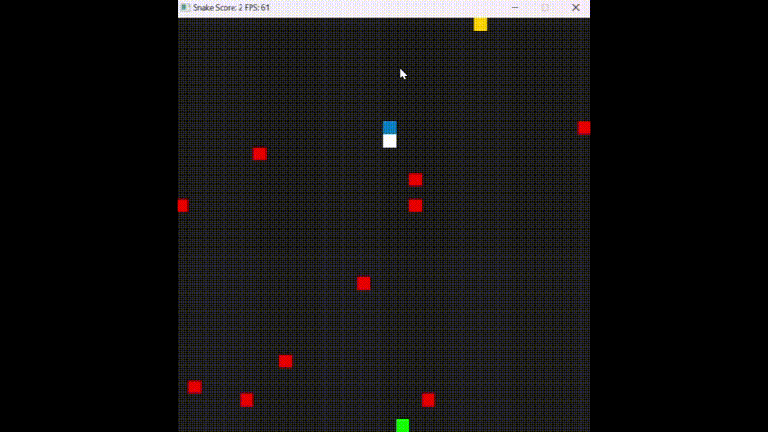

# CPPND: Capstone Snake Game Capstone Project


## Dependencies for Running Locally
* cmake >= 3.7
  * All OSes: [click here for installation instructions](https://cmake.org/install/)
* make >= 4.1 (Linux, Mac), 3.81 (Windows)
  * Linux: make is installed by default on most Linux distros
  * Mac: [install Xcode command line tools to get make](https://developer.apple.com/xcode/features/)
  * Windows: [Click here for installation instructions](http://gnuwin32.sourceforge.net/packages/make.htm)
* SDL2 >= 2.0
  * All installation instructions can be found [here](https://wiki.libsdl.org/Installation)
  >Note that for Linux, an `apt` or `apt-get` installation is preferred to building from source. 
* gcc/g++ >= 5.4
  * Linux: gcc / g++ is installed by default on most Linux distros
  * Mac: same deal as make - [install Xcode command line tools](https://developer.apple.com/xcode/features/)
  * Windows: recommend using [MinGW](http://www.mingw.org/)

## Basic Build Instructions

1. Clone this repo.
```bash
https://github.com/Infrx/CppND-Capstone-Snake-Game/blob/main/README.md
```
3. Make a build directory in the top level directory:
```bash
mkdir build && cd build
```
3. Compile:
```bash
cmake .. & make
```
5. Run it:
```bash
./SnakeGame
```
## New Features
- Receive game speed input from user
- Press "Spacebar" to double the speed of snake and press it again to switch it to normal
- Randomly generated obstacles (Player is immune until the snake eats the first food)
- Crushing into obstacles also results in game over
- Game results are copied into `/build/gameresults.txt`

## Rubric Compliance
-Loops, Functions, I/O - meet at least 2 criteria

<table>
<tr>
<td> Criteria </td> <td> Location </td>
</tr>
<tr>
<td> The project reads data from a file and process the data, or the program writes data to a file. </td>
<td>

in `utilities.cpp line 16`
```cpp
void Utilities::storeGameResult()
{
	std::ofstream file;
	file.open("\src\gameresults.txt", std::ios::app); // Open file in append mode

	if (file.is_open()) 
	{
		file << "size:" << _game.GetSize() << ", score:" << _game.GetScore() << std::endl; 
		file.close();
		std::cout << "Game results are stored succesfully!\n";
	}
	else 
	{
		std::cerr << "Unable to open file." << std::endl;
	}
}
```


</td>
</tr>
<tr>
<td> The project accepts user input and processes the input. </td>
<td>

in `utilities.cpp line 36`
```cpp
int Utilities::getGameSpeed()
{
	
	while (true)
	{
		std::cout << "Please enter game speed as integer between 1 and 3, 2\n";
		std::cout << "1 for normal speed\n";
		std::cout << "2 for double speed\n";
		std::cout << "3 for triple speed\n";
		std::cin >> _gameSpeed;
		if (std::cin.fail())
		{
			std::cin.clear(); // Clear the error flag
			std::cin.ignore(std::numeric_limits<std::streamsize>::max(), '\n'); // Discard invalid input
			std::cout << "Invalid input. Please enter a valid integer.\n";
		}
		else if (_gameSpeed < 1 || _gameSpeed > 3)
			std::cout << "Input out of range. Please try again.\n";
		else
			break; // Valid integer within range, exit the loop
	}
	return _gameSpeed;
}

void Utilities::setGameSpeed()
{
	_game._gameSpeed = _gameSpeed;
	std::cout << "Game speed successfully set!\n";

}
```

</td>
</tr>
</table>
 

-Object Oriented Programming - meet at least 3 criteria


<table>
<tr>
<td> Criteria </td> <td> Location </td>
</tr>
<tr>
<td> One or more classes are added to the project with appropriate access specifiers for class members. </td>
<td>

in `utilities.h line 9`
```cpp
class Utilities
{
public:
	Utilities(Game& game, Renderer& renderer);
	~Utilities();
	void storeGameResult();
private:
	int getGameSpeed();
	void setGameSpeed();
	void setGameSpeed(int speed);
	int _gameSpeed{};
	Game& _game;
	Renderer& _renderer;
};
```


</td>
</tr>
<tr>
<td> Class constructors utilize member initialization lists. </td>
<td>

in `utilities.cpp line 3`
```cpp
Utilities::Utilities(Game& game, Renderer& renderer)
	: _game(game), _renderer(renderer)
{
	getGameSpeed();
	setGameSpeed();
}
```

</td>
</tr>
<tr>
<td> Overloaded functions allow the same function to operate on different parameters. </td>
<td>

in `utilities.cpp line 60`
```cpp
void Utilities::setGameSpeed()
{
	_game._gameSpeed = _gameSpeed;
	std::cout << "Game speed successfully set!\n";

}

void Utilities::setGameSpeed(int speed)
{
	_game._gameSpeed = speed;
}
```

</td>
</tr>
</table>

-Memory Management - meet at least 3 criteria

<table>
<tr>
<td> Criteria </td> <td> Location </td>
</tr>
<tr>
<td> The project makes use of references in function declarations. </td>
<td>

in `utilities.h line 20`
```cpp
	Game& _game;
	Renderer& _renderer;
```


</td>
</tr>
<tr>
<td> The project follows the Rule of 5. </td>
<td>

All classes comply.

</td>
</tr>
<tr>
<td> The project uses smart pointers instead of raw pointers. </td>
<td>

in `game.h line 26`
```cpp
using ObstaclePtr = std::shared_ptr<std::vector<Obstacle>>;
ObstaclePtr obstacles = std::make_shared<std::vector<Obstacle>>();
```

</td>
</tr>
</table>


-Concurrency - meet at least 2 criteria

<table>
<tr>
<td> Criteria </td> <td> Location </td>
</tr>
<tr>
<td> The project uses multithreading. </td>
<td>

in `game.cpp line 23`
```cpp
std::future<void> future = std::async(std::launch::async, &Game::GenerateObstacle, this, obstacles);
  future.wait();
  std::this_thread::sleep_for(std::chrono::milliseconds(100));
```


</td>
</tr>
<tr>
<td> A mutex or lock is used in the project. </td>
<td>

in `game.cpp line 126`
```cpp
void Game::GenerateObstacle(ObstaclePtr obstacles)
{
    std::lock_guard<std::mutex> lock(_mutex);
    std::random_device rd;
    std::mt19937 gen(rd());
    std::uniform_int_distribution<> disX(0, static_cast<int>(_gridWidth - 1));
    std::uniform_int_distribution<> disY(0, static_cast<int>(_gridHeight - 1));
    int _tempX{};
    int _tempY{};
    int tempX{};
    int tempY{};
    // Simulate obstacle generation
    for (int i = 0; i < 10; ++i)
    {
        
        tempX = disX(gen);
        tempY = disY(gen);
        if (tempX != _tempX && tempY != _tempY) // checks for duplicate obstacles
        {
            Obstacle obs = { disX(gen) * _screenWidth / _gridWidth, disY(gen) * _screenWidth / _gridHeight };
            obstacles->push_back(obs);
        }
        else
            --i;
        std::this_thread::sleep_for(std::chrono::milliseconds(1)); // Simulate delay
        _tempX = tempX;
        _tempY = tempY;
    }
}
```

</td>
</tr>
</table>

## CC Attribution-ShareAlike 4.0 International


Shield: [![CC BY-SA 4.0][cc-by-sa-shield]][cc-by-sa]

This work is licensed under a
[Creative Commons Attribution-ShareAlike 4.0 International License][cc-by-sa].

[![CC BY-SA 4.0][cc-by-sa-image]][cc-by-sa]

[cc-by-sa]: http://creativecommons.org/licenses/by-sa/4.0/
[cc-by-sa-image]: https://licensebuttons.net/l/by-sa/4.0/88x31.png
[cc-by-sa-shield]: https://img.shields.io/badge/License-CC%20BY--SA%204.0-lightgrey.svg
